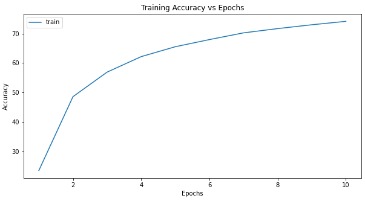
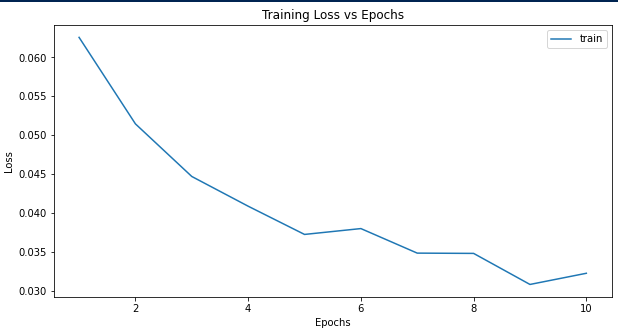
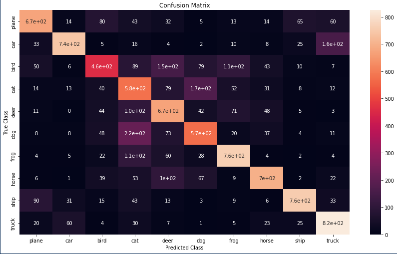

# Image-Classifier-CIFAR-10
CIFAR-10 is an established computer-vision dataset used for object recognition. It is a subset of the 80 million tiny images dataset and consists of 60,000 32x32 color images containing one of 10 object classes, with 6000 images per class. Using this we develop a model that can classify images

#### Overview basic backprop neural network
Artificial Neural Networks are computational learning systems that uses a network of functions to understand and translate a data input of one form into a desired output, usually in another form. The concept of the artificial neural network was inspired by human biology and the way neurons of the human brain function together to understand inputs from human senses.

A simple neural network consists of Input Layer, Hidden Layer and Output Layer.
To train these the network, we will use Backpropagation algorithm.  Backpropagation is the cornerstone of modern neural networks. To understand the algorithm in details, here is a mathematical description in the Chapter 2 of *How the backpropagation algorithm works from Neural Networks and Deep Learning* (http://neuralnetworksanddeeplearning.com/chap2.html).

In this part, you are required to implement the following architecture and write training code of a neural network from scratch using the numpy library alone. 

Architecture Definition :

*   An Input Layer with the following 2-dimensions:
  *  0: Batch Size
  *  1: 784 = 28*28 pixels
* A hidden layer with 500 units
* A second hidden layer with 50 units
* An output layer with 10 units

There are five major steps to the implementation:

1. Define neural network: initialize_network()

2. Forward Propagation: pre_activation(), sigmoid_activation(), forward_propagation()

3. Backpropagation: backward_propagate_error()

4. Loss function and updation of weights (SGD): update_weights()

5. Training: train()


# Training an Image Classifier

##Overview
CIFAR10 dataset will be used to train an image classifier.


###Define a Convolutional Neural Network 

Creating a neural network that take 3-channel images. 
##Network archtecture:
```
Conv2d --> ReLU --> MaxPool2d --> Conv2d --> ReLU --> MaxPool2d --> Flatten --> Linear --> ReLU --> Linear --> ReLU --> Linear
```
# Results 





 
# File Structure
```
📦Image-Classifier-CIFAR-10
 ┣ 📂results
 ┃ ┣ 📜Accuracy_v_Epochs.png
 ┃ ┣ 📜back_prop.png
 ┃ ┣ 📜confusion_matrix.png
 ┃ ┗ 📜loss_v_epoch.png
 ┣ 📜Image_classifier_CIFAR_10.ipynb
 ┣ 📜LICENSE
 ┗ 📜README.md
```
